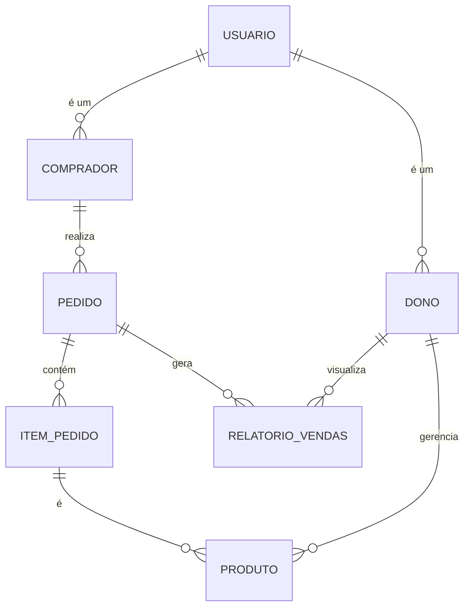
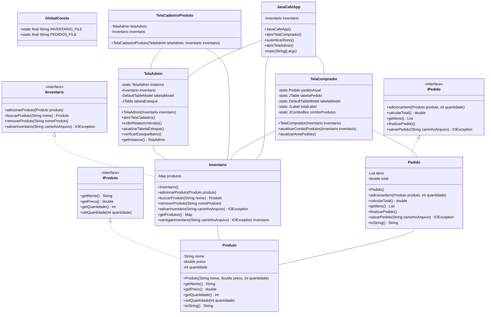

<br />
<div align="center">
  <a href="https://github.com/othneildrew/Best-README-Template">
    
  </a>

  <h3 align="center">SCC0504 - Programação Orientada a Objetos</h3>

  <p align="center">
    Este é um sistema de gerenciamento de uma cafeteria, onde o usuário tem a visão de Administrador e Comprador, compartilhando a inserção / consumo de estoque de produtos. Além disso, todas as transações feitas pelos compradores são salvos em um arquivo de "LOG" para registros.
  </p>
</div>

## Requisitos
- Java Development Kit (JDK) 11 ou superior
- IDE de sua escolha (Eclipse, IntelliJ, etc.)

## Funcionalidades Principais
1. **Controle de Estoque**: Permite que o Dono do Java Café gerencie os produtos disponíveis no café, tendo um alerta quando os níveis de estque estão baixos.
2. **Controle de Pedidos**: Gerência os pedidos efetuados pelos compradores, atualizando o relatório de vendas e estoque.
3. **Relatório de Vendas**: Permite que o Dono do Java Café visualize as compras dos clientes, com uma visão de faturamento total por pedido.

## Diagramas

### Diagrama de Entidades e Relacionamentos


### Diagrama de Classes


## Testes
No código não foi implementado um caderno de testes, poorém, poderíamos ter implementado em JUnit testes para os PRODUTOS dessa forma por exemplo:
```Java
class ProdutoTest {
    private Produto produto;

    @BeforeEach
    void setUp() {
        produto = new Produto("Café", 10.0, 100);
    }

    @Test
    void testGetNome() {
        assertEquals("Café", produto.getNome());
    }

    @Test
    void testGetPreco() {
        assertEquals(10.0, produto.getPreco());
    }

    @Test
    void testGetQuantidade() {
        assertEquals(100, produto.getQuantidade());
    }

    @Test
    void testSetQuantidade() {
        produto.setQuantidade(50);
        assertEquals(50, produto.getQuantidade());
    }
}
```
A saída esperada para esse teste seria:

```cmd
[INFO] -------------------------------------------------------
[INFO]  T E S T S
[INFO] -------------------------------------------------------
[INFO] Running ProdutoTest
[INFO] Tests run: 4, Failures: 0, Errors: 0, Skipped: 0, Time elapsed: 0.008 s - in ProdutoTest
[INFO]
[INFO] Results:
[INFO]
[INFO] Tests run: 4, Failures: 0, Errors: 0, Skipped: 0
```

## Instalação
1. Faça um clone desse repositório ou realize o download em .ZIP.
2. Abra o projeto na sua IDE de preferência, no caso do Intelij IDEA é só abrir a pasta clonada, no caso de outras IDE's indico copiar os arquivos ``.java`` e colar-los no main que a IDE executa.
3. Atualize a variável ``_PATH`` localizada na classe ``src/Utils/GlobalConsts``: 
    ````
   private static final String _PATH
    ````
   Para o caminho que você salvou o projeto. <br/>
   **OBS:** Verifique o sistema operacional que você está utilizando, o caminho para UNIX é diferente do Windows.
   
## Utilização

Para utilizar o sistema, basta executar o arquivo ``JavaCafeApp.java`` na sua IDE de preferência, eu no caso utilizei o Intelij IDEA.


## Aluno
### Adriano da Silva de Carvalho - 13692400

